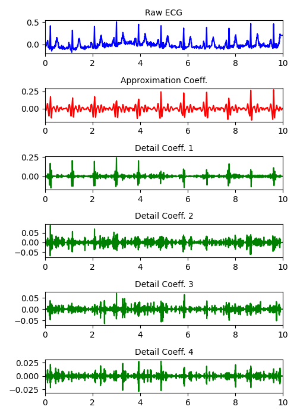

# ECG Preprocessing:
This repository preprocesses ECG signals (lead II) and generates the corresponding scalogram for use in machine learning applications. 
I used two steps: 
<ol>
  <li>Bandpass filtering to remove artifacts and baseline drift (Wc: [40,150]).</li>
  <li>Wavelet denoising using adaptive wavelet thresholding (pywt).</li>
</ol>

</img>

<h3> Scalogram of Bandpassed ECG Signal: </h3>
</img>
<h3> Scalogram of ECG Signal After Wavelet Denoising: </h3>
</img>

# Additional Denoising:
I decomposed the bandpassed ECG signal into its approximation and detail coefficients using the discrete wavelet transform (sym6 wavelet).
<ul>
  <li>The approximation coefficient, and detail coefficient 1 seem to be more representative of the original waveform.</li>
  <li>The other detail coefficients contain other high frequency noise which may not be useful for visualization.</li>
</ul>
Thus, I made the choice to apply thresholding to the detail coefficient 1 (same method as before). Then I applied the inverse DWT to the approximation and detail coefficient1 to reconstruct a cleaner signal than just bandpassing alone.
</img>
</img>
